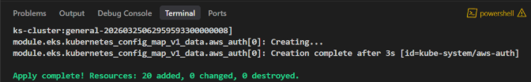
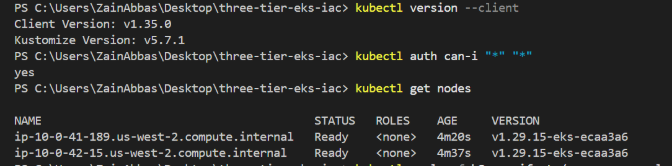
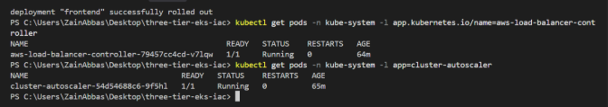
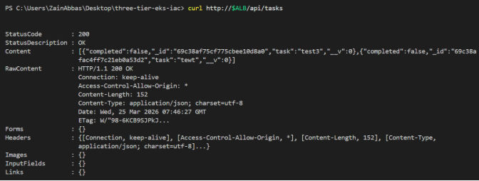
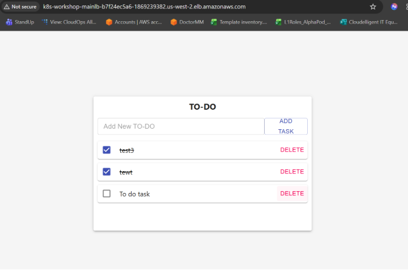

Three-Tier App on AWS EKS  ·  Beginner's Complete Guide

**Three-Tier Application**

**on AWS EKS**

A Complete Beginner's Guide

React  ·  Node.js  ·  MongoDB  ·  Docker  ·  Kubernetes  ·  Terraform  ·  AWS

**What you will learn**

|
**What is a Three-Tier App?**

Understand the architecture used by real-world web apps
|
**What is Kubernetes?**

How containers are managed at scale in the cloud
|
**What is Terraform?**

How to build cloud infrastructure using code
|
**How it all fits together**

Deploy the full stack end-to-end on AWS
|
| :- | :- | :- | :- |

|
**Chapter 1**

The Big Picture — What Are We Building?
|
| :- |

## **1.1  The Three-Tier Architecture**
Before writing a single line of code or configuration, it is important to understand the architecture we are building. Almost every modern web application — from Netflix to your bank's website — uses a variant of this pattern.

|
**📖  What is Three-Tier Architecture?**

A way of organising a web application into three separate layers, each with a distinct job. They talk to each other in one direction: the user talks to the Presentation tier, which talks to the Logic tier, which talks to the Data tier. No tier skips another.
|
| :- |

|**Tier**|**What it is**|**Job in this project**|
| :- | :- | :- |
|**Tier 1**|**Presentation (Frontend)**|The React web page the user sees in their browser. It shows the to-do list and sends actions (add, delete, complete) to the API.|
|**Tier 2**|**Logic (Backend API)**|The Node.js server that processes requests. It validates data, talks to the database, and sends responses back to the frontend.|
|**Tier 3**|**Data (Database)**|The MongoDB database that stores all the to-do tasks permanently. Only the backend can access it directly.|

### **How a request flows through the tiers**
When a user types a task and clicks Add, here is what happens step by step:

1. The browser (React) sends a POST request to the API URL over the internet.
1. The request hits the AWS Load Balancer, which forwards it to one of the Node.js backend pods.
1. The Node.js server reads the request body, creates a new task document, and calls MongoDB to save it.
1. MongoDB saves the document and confirms success.
1. Node.js sends the saved task back to React as JSON.
1. React adds the task to the list on screen without reloading the page.

|
**→  Real-world analogy**

Think of a restaurant. The menu and waiter are the Frontend (Tier 1) — that is what the customer interacts with.

The kitchen is the Backend (Tier 2) — it processes the order and applies the rules.

The pantry/fridge is the Database (Tier 3) — it stores all the ingredients (data).

Customers never walk into the pantry. The waiter never cooks. Each tier does exactly one job.
|
| :- |

## **1.2  Why Run This on Kubernetes?**

|
**📖  What is Kubernetes (K8s)?**

An open-source system that automatically manages containers. It decides which server to run each container on, restarts containers that crash, scales up when traffic increases, and distributes traffic across healthy containers. Think of it as an operating system for a fleet of servers.
|
| :- |

You could run this app directly on a virtual machine (EC2 instance), but you would need to manually restart it if it crashes, manually scale it when traffic spikes, manually update it without downtime, and manually manage its configuration. Kubernetes does all of this automatically. AWS EKS (Elastic Kubernetes Service) is a managed version of Kubernetes — AWS runs the Kubernetes control plane for you so you only manage the applications.

## **1.3  The Full Architecture Diagram**
Here is the complete picture of every component and how they connect:

|
**AWS Cloud  ·  us-west-2**

[ Internet / User Browser ]

↓  HTTP request
|
| :-: |

|
**Application Load Balancer  (ALB)**

Routes  /api  →  backend service  |  Routes  /  →  frontend service
|
| :-: |

|↓  routes to Kubernetes Services|
| :-: |

|**VPC  10.0.0.0/16  ·  EKS Cluster  (Kubernetes)**|
| :-: |

|
**Frontend Pod**

React App

Port 3000

1 replica
|
**Backend Pods**

Node.js API

Port 8080

2 replicas
|
**MongoDB Pod**

Database

Port 27017

1 replica
|
| :-: | :-: | :-: |

||
| :-: |

|
**General Node Group**

t3.small  ·  ON\_DEMAND  ·  1-10 nodes
|
**Spot Node Group**

t3.micro  ·  SPOT  ·  taint: NO\_SCHEDULE
|
| :-: | :-: |

||
| :-: |

||
| :-: |

|
**AWS Load Balancer Controller**

Watches Ingress resources and provisions ALBs in AWS automatically
|
**Cluster Autoscaler**

Automatically adds/removes EC2 nodes based on pod resource demand
|
| :- | :- |

||
| :-: |

|
**IAM Roles (IRSA)**

Secure, scoped AWS permissions for each controller pod
|
**S3 Bucket (Terraform State)**

Stores Terraform's record of what it has created in AWS
|
| :- | :- |

||
| :-: |

|
**Chapter 2**

Core Concepts Explained Simply
|
| :- |

## **2.1  Containers and Docker**

|
**📖  What is Container?**

A container is a lightweight, isolated package that contains an application and everything it needs to run — the code, runtime, libraries, and settings. It runs the same way on any computer. Think of it like a shipping container: the contents are sealed and consistent regardless of which ship (server) carries it.
|
| :- |

Without containers, a common problem was: 'It works on my machine but not on the server.' This happens because the developer's laptop has different software versions than the server. A container eliminates this by bundling the application with its exact environment.

|
**📖  What is Docker?**

The most popular tool for building and running containers. You write a Dockerfile that describes how to build your application image, and Docker packages everything into a single portable file called an image.
|
| :- |

### **How a Dockerfile works**
The backend Dockerfile for this project:

|**Line**|**What it means**|
| :- | :- |
|FROM node:14|Start with an official Node.js 14 image as the base. This already has Node.js and npm installed.|
|WORKDIR /usr/src/app|Set the working directory inside the container to this path.|
|COPY package\*.json ./|Copy package.json into the container first (before the code).|
|RUN npm install|Install all Node.js dependencies listed in package.json.|
|COPY . .|Now copy all the application source code into the container.|
|CMD ["node", "index.js"]|When the container starts, run this command to start the server.|

|
**→  Why copy package.json first?**

Docker builds images in layers. If you copy package.json first and run npm install, Docker caches that layer. The next time you build, if only your source code changed (not package.json), Docker reuses the cached npm install layer — saving minutes of build time.
|
| :- |

## **2.2  Kubernetes — The Container Orchestrator**

|
**📖  What is Orchestration?**

Managing many containers across many servers — deciding where each container runs, restarting it if it crashes, and ensuring the right number of copies are always running. Kubernetes does all of this.
|
| :- |

Kubernetes introduces several key building blocks. Understanding these terms makes the YAML manifests much easier to read:

|**Term**|**Plain-English Explanation**|
| :- | :- |
|Pod|The smallest unit in Kubernetes. A pod is one or more containers that run together on the same server. In this project, each deployment creates pods with one container each.|
|Deployment|A blueprint that says 'I want N copies of this pod always running'. If a pod crashes, the Deployment automatically creates a replacement. If you update the image, it does a rolling replacement.|
|Service|A stable internal address for a set of pods. Pods get new IP addresses every time they restart, but a Service always points to the current healthy pods. Other pods talk to Services, not directly to pods.|
|Ingress|A set of rules that defines how external HTTP traffic reaches Services inside the cluster. In AWS, an Ingress creates a real Application Load Balancer.|
|Namespace|A way to group resources inside a cluster. This project uses the 'workshop' namespace to keep all app resources together, separate from system resources.|
|Secret|A Kubernetes object that stores sensitive data (passwords, tokens) separately from application code. Pods can read Secrets as environment variables.|
|ConfigMap|Like a Secret but for non-sensitive configuration. Not used in this project but common in production.|
|Node|A physical or virtual machine that Kubernetes runs pods on. This project uses EC2 instances as nodes.|

### **How a Deployment keeps your app running**
When you apply a Deployment manifest, Kubernetes creates a ReplicaSet that constantly watches the cluster. If the number of running pods drops below the desired count (because a pod crashed or a node went down), the ReplicaSet immediately creates new pods to compensate. This is called self-healing.

The backend Deployment specifies 2 replicas. This means two copies of the Node.js container are always running on different nodes. If one node fails, the other pod continues serving traffic while Kubernetes creates a replacement on a healthy node.

## **2.3  AWS EKS — Managed Kubernetes**

|
**📖  What is Amazon EKS (Elastic Kubernetes Service)?**

A managed Kubernetes service from AWS. AWS runs the Kubernetes control plane (the master components that make decisions) so you only need to manage the worker nodes where your applications actually run.
|
| :- |

Running Kubernetes yourself requires maintaining etcd (the database), the API server, the scheduler, and other control plane components. EKS does all of this for you, handles upgrades, and integrates natively with other AWS services like IAM, VPC, ALB, and EBS.

## **2.4  Terraform — Infrastructure as Code**

|
**📖  What is Infrastructure as Code (IaC)?**

Writing your cloud infrastructure (VPCs, servers, databases, load balancers) as code files instead of clicking through the AWS console. This means your infrastructure is version-controlled, repeatable, and can be destroyed and recreated reliably.
|
| :- |

|
**📖  What is Terraform?**

The most popular IaC tool. You write .tf files describing the resources you want, run terraform plan to preview changes, and terraform apply to create them. Terraform tracks what it has created in a state file so it knows what to change or delete next time.
|
| :- |

|**Without Terraform (Manual)**|**With Terraform (IaC)**|
| :- | :- |
|Click through the AWS console to create each resource|Write code files that describe every resource|
|Easy to make mistakes — hard to reproduce exactly|Reproducible — run the same code, get the same infrastructure|
|No record of what you created or why|Git history shows every change and who made it|
|Deleting everything requires clicking through the console|terraform destroy removes everything in the right order|
|Can't easily share the setup with a teammate|Share the .tf files and they can deploy the exact same thing|

## **2.5  Networking — VPC, Subnets, and NAT**

|
**📖  What is VPC (Virtual Private Cloud)?**

Your private network inside AWS. Think of it as a fenced plot of land in the AWS data centre that belongs only to you. Resources inside the VPC can talk to each other but cannot be reached from the internet unless you explicitly open a door.
|
| :- |

This project creates a VPC with four subnets:

|**Subnet**|**CIDR**|**Type**|**Purpose**|
| :- | :- | :- | :- |
|**Public 1**|10\.0.64.0/19|Public|ALB lives here — internet can reach it directly|
|**Public 2**|10\.0.96.0/19|Public|Second AZ for redundancy|
|**Private 1**|10\.0.0.0/19|Private|EKS worker nodes — not directly reachable from internet|
|**Private 2**|10\.0.32.0/19|Private|Second AZ for node redundancy|

|
**📖  What is NAT Gateway?**

Network Address Translation Gateway. Worker nodes in private subnets need to download software from the internet (like Docker images from ECR). The NAT Gateway lets private resources make outbound internet connections without being directly reachable from the internet. Like a one-way door.
|
| :- |

## **2.6  IAM and IRSA — Security in AWS**

|
**📖  What is IAM (Identity and Access Management)?**

AWS's permission system. Every action in AWS (creating an EC2 instance, reading an S3 bucket, creating a load balancer) requires an IAM permission. IAM roles define what actions are allowed.
|
| :- |

|
**📖  What is IRSA (IAM Roles for Service Accounts)?**

A way to give individual Kubernetes pods specific AWS permissions without giving those permissions to every pod on the node. Each pod gets its own IAM role, bound to a Kubernetes ServiceAccount, using OIDC federation. This is the recommended security practice for EKS.
|
| :- |

This project uses IRSA for two components that need AWS permissions:

- **The ALB Controller needs permission to create, update, and delete Application Load Balancers in AWS.**
- **The Cluster Autoscaler needs permission to scale EC2 Auto Scaling Groups up and down.**

|
**→  Why IRSA instead of node-level permissions?**

The alternative is to attach permissions to the EC2 node itself — meaning every pod on that node inherits those permissions. If the ALB Controller pod is compromised, it could create load balancers. But if every pod on the node is compromised, the blast radius is much larger. IRSA limits permissions to exactly the pod that needs them.
|
| :- |

|
**Chapter 3**

The Application — What Are We Deploying?
|
| :- |

## **3.1  The To-Do Application**
The application is a simple To-Do list where users can add tasks, mark them as complete, and delete them. It is intentionally simple so you can focus on the infrastructure rather than the application code.

### **How the three tiers talk to each other**

|**From**|**To**|**How**|
| :- | :- | :- |
|**User Browser**|React Frontend|The browser loads React from the frontend pod via the ALB. All subsequent requests happen in JavaScript without full page reloads.|
|**React Frontend**|Node.js Backend|Axios (HTTP library) sends REST API calls to the ALB URL. The ALB routes /api paths to the backend Service, which distributes to backend pods.|
|**Node.js Backend**|MongoDB|Mongoose (MongoDB library) connects using the internal DNS name 'mongodb-svc:27017'. This never leaves the cluster.|

## **3.2  The Backend API Endpoints**
The Node.js backend exposes four REST API endpoints for managing tasks, plus a health check:

|**Method + Path**|**Action**|**What happens**|
| :- | :- | :- |
|**GET /ok**|**Health check**|Returns the text 'ok'. Used by Kubernetes liveness/readiness probes and by the ALB health check to verify the server is running.|
|**GET /api/tasks**|**Get all tasks**|Queries MongoDB for all task documents and returns them as a JSON array. Called when the page loads.|
|**POST /api/tasks**|**Create a task**|Receives a JSON body with a task title, saves a new document to MongoDB, returns the created document.|
|**PUT /api/tasks/:id**|**Update a task**|Finds the task by its MongoDB ID and updates it (e.g. toggling completed to true). Used when checking off a task.|
|**DELETE /api/tasks/:id**|**Delete a task**|Finds and removes the task document from MongoDB. Used when clicking the delete button.|

## **3.3  Kubernetes Manifests — What Each File Does**
A Kubernetes manifest is a YAML file that describes a desired state. You hand it to Kubernetes with kubectl apply, and Kubernetes works to make reality match what you described. Here is what each manifest in this project creates:

|**File**|**What it creates and why**|
| :- | :- |
|**mongo/secrets.yaml**|A Kubernetes Secret named 'mongo-sec' containing the MongoDB username and password as base64-encoded values. Must be created first because the MongoDB deployment reads from it.|
|**mongo/deploy.yaml**|A Deployment that runs one MongoDB 4.4.6 container. Includes resource limits to prevent MongoDB from consuming all available memory on the node, and reads credentials from the Secret.|
|**mongo/service.yaml**|A ClusterIP Service named 'mongodb-svc' on port 27017. This gives MongoDB a stable internal DNS name so the backend can connect with 'mongodb://mongodb-svc:27017'.|
|**backend-deployment.yaml**|A Deployment that runs two copies of the Node.js API. Both replicas connect to the same MongoDB, providing redundancy. Includes health check probes on /ok.|
|**backend-service.yaml**|A ClusterIP Service named 'api' on port 8080. The Ingress sends /api traffic here; Kubernetes load-balances between the two backend pods automatically.|
|**frontend-deployment.yaml**|A Deployment that runs one copy of the React app. Contains the REACT\_APP\_BACKEND\_URL environment variable that tells the browser where to send API calls.|
|**frontend-service.yaml**|A ClusterIP Service named 'frontend' on port 3000. The Ingress sends all non-/api traffic here.|
|**full\_stack\_lb.yaml**|An Ingress resource. The ALB Controller reads this and creates an internet-facing AWS Application Load Balancer with two routing rules: /api → backend, / → frontend.|

|
**Chapter 4**

Step-by-Step Deployment Guide
|
| :- |

Now that you understand every concept and component, here is the complete deployment sequence. Each step explains not just what to do but why.

## **4.1  Prerequisites**

|**Tool**|**Why you need it**|
| :- | :- |
|AWS CLI v2|Communicates with your AWS account from the terminal. Terraform and kubectl both rely on it for authentication.|
|Terraform v1.x|Reads your .tf files and creates cloud infrastructure in AWS.|
|kubectl|The Kubernetes command-line tool. Applies YAML manifests and lets you inspect running pods, services, and logs.|
|Helm v3|A package manager for Kubernetes. Used to update chart repositories.|
|Docker|Only needed if you want to build and push your own container images.|
|git|Clones the repository to your machine.|

## **4.2  Phase 1 — AWS Setup**

|**1**|
**Configure AWS credentials**

Run aws configure and enter your IAM Access Key ID, Secret Access Key, region (us-west-2), and output format (json). This tells all AWS tools which account to use.
|
| :-: | :- |

|
aws configure

 

AWS Access Key ID     : AKIA...

AWS Secret Access Key : xxxxxx

Default region name   : us-west-2

Default output format : json
|
| :- |

|aws sts get-caller-identity   # Verify — should show your Account ID|
| :- |

|**2**|
**Create the S3 bucket for Terraform state**

Terraform needs to store a state file that tracks what it has created. This file must live somewhere persistent and shared — an S3 bucket is the standard choice. Bucket names are globally unique across all AWS accounts, so choose something unique.
|
| :-: | :- |

|
aws s3api create-bucket \

`  `--bucket YOUR-UNIQUE-BUCKET-NAME \

`  `--region us-west-2 \

`  `--create-bucket-configuration LocationConstraint=us-west-2

 

aws s3api put-bucket-versioning \

`  `--bucket YOUR-UNIQUE-BUCKET-NAME \

`  `--versioning-configuration Status=Enabled
|
| :- |

## **4.3  Phase 2 — Get the Code**

|**3**|
**Clone the repository and configure your bucket name**

Clone the project, then open terraform/backend.tf and replace the placeholder bucket name with the one you just created.
|
| :-: | :- |

|
git clone https://github.com/zanister67/three-tier-eks-iac.git

cd three-tier-eks-iac
|
| :- |

Open terraform/backend.tf and update the bucket name:

|
terraform {

`  `backend "s3" {

`    `bucket = "YOUR-UNIQUE-BUCKET-NAME"   # ← change this

`    `key    = "eks/terraform.tfstate"

`    `region = "us-west-2"

`  `}

}
|
| :- |

## **4.4  Phase 3 — Infrastructure with Terraform**

|**4**|
**terraform init — download providers and connect to S3**

This command downloads all provider plugins (AWS, kubectl, Helm) and the modules used in the .tf files. It also connects to your S3 backend bucket to read or initialise the state file.
|
| :-: | :- |

|
cd terraform

terraform init

 

# Expected output:

# Terraform has been successfully initialized!
|
| :- |

|
**✓  What providers are downloaded?**

hashicorp/aws — creates VPC, EKS, IAM, S3, and all AWS resources.

gavinbunney/kubectl — applies raw YAML files to Kubernetes from within Terraform.

hashicorp/helm — installs Helm charts (the Load Balancer Controller) into EKS.
|
| :- |

|**5**|
**terraform plan — preview changes before creating anything**

Plan shows every resource Terraform will create without actually creating anything. Always review this before apply. You should see roughly 55–65 resources planned.
|
| :-: | :- |

|
terraform plan

 

# Expected output includes lines like:

# + module.vpc.aws\_vpc.this[0] will be created

# + module.eks.aws\_eks\_cluster.this[0] will be created

# Plan: 62 to add, 0 to change, 0 to destroy.
|
| :- |

|**6**|
**terraform apply — provision everything (15–20 minutes)**

This creates all AWS resources in the correct order. Terraform knows the dependencies (e.g. EKS needs the VPC to exist first) and handles ordering automatically. Type 'yes' when prompted.
|
| :-: | :- |

|
terraform apply

 

# Type 'yes' when prompted

# Takes 15-20 minutes — the EKS cluster creation dominates the time

 

# Expected final output: 

# Apply complete! Resources: 20 added, 0 changed, 0 destroyed.
|
| :- |

|
**⚠  Cost warning**

The following AWS resources start billing immediately after apply:

EKS control plane: ~$0.10/hr   |   NAT Gateway: ~$0.045/hr

EC2 t3.small (general node): ~$0.021/hr   |   EC2 t3.micro (spot node): ~$0.003/hr

Total: approximately $0.20–0.30/hr. Run terraform destroy when you are done.
|
| :- |

## **4.5  Phase 4 — Connect kubectl to Your Cluster**

|**7**|
**Update kubeconfig — teach kubectl about your new cluster**

EKS doesn't automatically configure kubectl. This command writes the cluster endpoint, certificate, and authentication method into ~/.kube/config so kubectl knows how to reach your cluster.
|
| :-: | :- |

|
aws eks update-kubeconfig --name my-eks-cluster --region us-west-2

 

# Verify access:

kubectl auth can-i "\*" "\*"  `  `# Expected: yes

kubectl get nodes             # Expected: 2 nodes both Ready  
|
| :- |

|**8**|
**Verify cluster add-ons are running**

Before deploying your app, confirm the two critical add-ons installed by Terraform are healthy. The ALB Controller must be running before you create the Ingress.
|
| :-: | :- |

|
# Check AWS Load Balancer Controller

kubectl get pods -n kube-system -l app.kubernetes.io/name=aws-load-balancer-controller

# Expected: 1/1 Running

 

# Check Cluster Autoscaler

kubectl get pods -n kube-system -l app=cluster-autoscaler

# Expected: 1/1 Running 
|
| :- |

## **4.6  Phase 5 — Deploy the Application**

|**9**|
**Create the workshop namespace**

Namespaces isolate resources. All application resources (MongoDB, backend, frontend) will live in the 'workshop' namespace, separate from system pods in kube-system.
|
| :-: | :- |

|
kubectl create namespace workshop

 

# Set workshop as the default namespace for subsequent commands

kubectl config set-context --current --namespace workshop
|
| :- |

|**10**|
**Deploy MongoDB — Secret first, then Deployment, then Service**

The order here is critical. The Secret must exist before the Deployment starts, because the Deployment reads the database credentials from the Secret at startup. If the Secret doesn't exist, the pods will fail to start.
|
| :-: | :- |

|
cd k8s\_manifests

 

kubectl apply -f mongo/secrets.yaml    # Create the Secret FIRST

kubectl apply -f mongo/deploy.yaml     # Then the Deployment

kubectl apply -f mongo/service.yaml    # Then the Service

 

kubectl rollout status deployment/mongodb

# Expected: deployment 'mongodb' successfully rolled out
|
| :- |

|**11**|
**Deploy the Backend API**

The backend needs MongoDB to be running before it is useful (though it will start even if MongoDB is down — it will just fail to connect until MongoDB is ready).
|
| :-: | :- |

|
kubectl apply -f backend-deployment.yaml

kubectl apply -f backend-service.yaml

 

kubectl rollout status deployment/api

# Expected: deployment 'api' successfully rolled out

 

kubectl get pods -l role=api

# Expected: 2/2 pods Running
|
| :- |

|**12**|
**Deploy the Frontend**

The frontend is a React app. The REACT\_APP\_BACKEND\_URL environment variable tells the browser-side JavaScript where to send API requests. It must point to your ALB URL.
|
| :-: | :- |

|
kubectl apply -f frontend-deployment.yaml

kubectl apply -f frontend-service.yaml

 

kubectl rollout status deployment/frontend

# Expected: deployment 'frontend' successfully rolled out
|
| :- |

|**13**|
**Apply the Ingress — this triggers ALB creation**

When you apply this file, the ALB Controller sees the new Ingress resource, calls the AWS API, and creates a real Application Load Balancer in your public subnets. This takes 2–3 minutes. Watch the ADDRESS column appear.
|
| :-: | :- |

|
kubectl apply -f full\_stack\_lb.yaml

 

# Watch for the ALB hostname to appear

kubectl get ingress mainlb -w

 

# Wait until ADDRESS is populated:

# NAME     CLASS   HOSTS   ADDRESS

# mainlb   alb     \*       k8s-workshop-mainlb-xxxx.us-west-2.elb.amazonaws.com  ![ref1]
|
| :- |

|
**✓  Why does the ALB take 2-3 minutes?**

Creating an ALB involves provisioning load balancer nodes in multiple Availability Zones, registering target groups, configuring listeners, and waiting for health checks to pass. AWS does all of this asynchronously — the ALB Controller submits the request and polls until it is done.
|
| :- |

## **4.7  Phase 6 — Verify Everything Works**

|**14**|
**Check all pods are Running**

All four deployments should show pods in Running status with no restarts.
|
| :-: | :- |

|
kubectl get pods -n workshop

 

# Expected — all READY and Running:

# NAME                      READY   STATUS    RESTARTS

# api-xxxx-yyyy             1/1     Running   0

# api-xxxx-zzzz             1/1     Running   0

# frontend-xxxx-yyyy        1/1     Running   0

# mongodb-xxxx-yyyy         1/1     Running   0 ![ref1]
|
| :- |

|**15**|
**Test the API via curl**

Use the ALB hostname to send a real HTTP request to your backend. This confirms the full chain: internet → ALB → K8s Service → backend pod → MongoDB.
|
| :-: | :- |

|
ALB=k8s-workshop-mainlb-xxxx.us-west-2.elb.amazonaws.com

 

curl http://$ALB/ok

# Expected: ok

 

curl <http://$ALB/api/tasks> 

# Expected: []  (empty list on first run)

|
| :- |

|**16**|
**Open the frontend in a browser**

Navigate to the ALB hostname in your browser. You should see the TO-DO app. Add a task, mark it complete, delete it.
|
| :-: | :- |

|
**⚠  If you see Cannot GET / in the browser**

This means the Ingress host restriction is blocking you.

Edit full\_stack\_lb.yaml and remove the 'host:' line so all traffic is accepted.

Then run: kubectl apply -f full\_stack\_lb.yaml
|
| :- |

||
| :- |

|
**Chapter 5**

Understanding What Terraform Built
|
| :- |

This chapter walks through every Terraform file and explains what it does and why each design decision was made.

## **5.1  vpc.tf — The Network Foundation**
Everything else in this project lives inside the VPC. The VPC is created first because the EKS cluster, subnets, and NAT gateway all depend on it.

|**Setting**|**Why it is set this way**|
| :- | :- |
|cidr = 10.0.0.0/16|A /16 provides 65,536 IP addresses — far more than needed, but gives room to grow without recreating the network.|
|4 subnets across 2 AZs|Two Availability Zones (data centres) means if one AZ has an outage, the app continues running in the other.|
|single\_nat\_gateway = true|One NAT Gateway is cheaper than two (one per AZ). For a workshop, this is fine. Production would use one per AZ for redundancy.|
|Subnet tags for kubernetes.io|These tags tell the ALB Controller which subnets to place load balancers in. Without them, ALB provisioning silently fails.|
|enable\_dns\_hostnames = true|Required for EKS — nodes need DNS to resolve cluster endpoints and AWS service hostnames.|

## **5.2  eks.tf — The Cluster and Node Groups**
This is the most complex Terraform file. It creates the EKS cluster, two node groups, configures authentication, and adds the security rule for the ALB Controller.

### **The two node groups**

|**Node Group**|**Purpose and Design**|
| :- | :- |
|general (t3.small, ON\_DEMAND)|The reliable baseline. ON\_DEMAND instances are always available and never reclaimed. All application workloads land here by default. t3.small gives 2 vCPUs and 2 GB RAM — enough for all pods in this project.|
|spot (t3.micro, SPOT)|Cheap burst capacity. Spot instances use spare AWS capacity at 60–90% discount. The NO\_SCHEDULE taint prevents application pods from landing here unless they explicitly opt in. Reserved for batch jobs or interruption-tolerant workloads.|

### **The aws\_auth ConfigMap**
By default, only the IAM identity that created the EKS cluster can access it. The manage\_aws\_auth\_configmap setting tells Terraform to automatically add the eks-admin role to the cluster's authentication map, granting it full cluster admin permissions. Without this, you would have to manually edit the ConfigMap after creation.

### **The port 9443 security group rule**
The ALB Controller runs an admission webhook on port 9443. When you apply an Ingress manifest, the Kubernetes API server calls this webhook to validate it. The API server runs in the EKS control plane (managed by AWS). The webhook runs in a pod on your worker node. Without this security group rule opening port 9443 from the control plane, the API server cannot reach the webhook and kubectl apply -f full\_stack\_lb.yaml will hang.

## **5.3  iam.tf — The Permission Structure**
This file creates a layered permission structure that follows the principle of least privilege — every identity has exactly the permissions it needs, no more.

|**Resource**|**What it does**|
| :- | :- |
|**allow-eks-access policy**|Grants eks:DescribeCluster only. This is the minimum permission needed to call aws eks get-token and authenticate to the cluster.|
|**eks-admin role**|An IAM role that can be assumed by any identity in the AWS account. When assumed, it grants access to the cluster via the aws\_auth ConfigMap mapping.|
|**user1 IAM user**|A demo IAM user created as a student exercise. Has no access keys (create\_iam\_access\_key = false) so it cannot be used until manually configured.|
|**allow-assume-eks-admin-iam-role policy**|Grants sts:AssumeRole for the eks-admin role specifically. This is what a user needs to switch into the admin role.|
|**eks-admin IAM group**|A group that user1 belongs to. The group has the assume-role policy attached, so user1 inherits the ability to assume the eks-admin role.|

## **5.4  How the ALB Controller Gets AWS Permissions (IRSA)**
This is one of the more advanced concepts in the project, worth understanding thoroughly because it is a security best practice used in every production EKS deployment.

### **The problem IRSA solves**
The ALB Controller pod needs to call AWS APIs to create load balancers. In the early days of Kubernetes on AWS, the way to grant this was to attach IAM permissions to the EC2 node. This meant every pod on that node — whether it was the ALB Controller or a random app pod — had the same AWS permissions. That is a significant security risk.

### **How IRSA works**

1. Terraform enables IRSA on the EKS cluster, which creates an OIDC (OpenID Connect) identity provider in AWS IAM.
1. Terraform creates an IAM role with a trust policy that says: 'Only allow this role to be assumed by the service account named aws-load-balancer-controller in the kube-system namespace, via this specific OIDC provider.'
1. The Helm chart installs the ALB Controller with a Kubernetes ServiceAccount annotated with the ARN of that IAM role.
1. When the ALB Controller pod starts, it contacts the EKS OIDC provider, which issues a token. The pod exchanges that token for temporary AWS credentials for the specific IAM role.
1. Only that one pod can do this — no other pod in the cluster can assume that role.

|
**→  Why this matters for security**

With IRSA, if an attacker compromises the ALB Controller pod, they can only create/delete load balancers (the permissions the role grants). They cannot access S3, create EC2 instances, or do anything else. With node-level IAM, a compromised pod on the same node could do anything the node is permitted to do.
|
| :- |

|
**Chapter 6**

Troubleshooting Common Issues
|
| :- |

Every issue has a diagnostic path. The key is to work from the outside in: start at the ALB, follow the request inward to the pod, and check logs at each step.

|**Symptom**|**First command to run**|**What to look for**|
| :- | :- | :- |
|**Browser shows 'No page found'**|kubectl get ingress mainlb -n workshop|Check if ADDRESS column has a hostname. If empty, ALB hasn't been provisioned yet — wait 2–3 more minutes.|
|**ALB health checks return 404**|AWS Console → EC2 → Target Groups|Check which path the health check is using. Backend needs /ok not /. Add healthcheck-path annotation to Ingress.|
|**Pod is in Pending state**|kubectl describe pod <name>|Look at the Events section. Usually: not enough CPU/memory on any node, or the node has a taint the pod doesn't tolerate.|
|**Pod is in CrashLoopBackOff**|kubectl logs <pod-name>|Read the crash output. Backend: usually MongoDB connection error (check Secret was applied). Frontend: usually npm error.|
|**Tasks fail with ERR\_NAME\_NOT\_RESOLVED**|kubectl get deployment frontend -o yaml|Check REACT\_APP\_BACKEND\_URL — it must be your ALB hostname, not Some random url.|
|**terraform apply fails on Helm**|Re-run terraform apply|The EKS cluster was not fully ready when Helm ran. Apply is idempotent — safe to re-run.|
|**kubectl: 'no such host'**|aws eks update-kubeconfig|Your kubeconfig is stale or missing. Re-run update-kubeconfig with your cluster name and region.|
|**ALB ADDRESS never appears**|kubectl logs -n kube-system -l app.kubernetes.io/name=aws-load-balancer-controller|Look for IAM permission errors (IRSA misconfigured) or subnet tag errors (missing kubernetes.io tags).|

## **6.1  Diagnostic Toolkit — Commands Every Beginner Should Know**

|**Command**|**What it tells you**|
| :- | :- |
|kubectl get pods -n workshop|Lists all pods, their status, number of restarts, and age. READY 1/1 means healthy.|
|kubectl describe pod <name>|Full details about a pod including which node it's on, its resource usage, and crucially, the Events section showing why it might be failing.|
|kubectl logs <pod-name>|The stdout/stderr output from the container. The most useful tool for understanding crashes.|
|kubectl logs -f <pod-name>|Follow logs in real time. Use Ctrl+C to stop.|
|kubectl get events -n workshop|All events in the namespace sorted by time. Often reveals why pods are stuck.|
|kubectl exec -it <pod> -- /bin/sh|Opens a shell inside a running container. Useful to test connectivity (e.g. ping mongodb-svc from inside a backend pod).|
|kubectl get ingress -n workshop|Shows all Ingress resources and their ALB address.|
|kubectl rollout status deployment/<n>|Waits and reports whether a deployment rolled out successfully.|
|kubectl rollout restart deployment/<n>|Forces all pods in a deployment to be replaced. Useful after changing an env var.|

|
**Chapter 7**

Cleanup and Cost Management
|
| :- |

|
**⚠  Always clean up when you are done**

AWS charges for resources even when they are idle. The EKS cluster, NAT Gateway, and EC2 nodes all incur ongoing hourly charges. A full deployment costs approximately $0.20–0.30/hr.
|
| :- |

## **7.1  The Correct Cleanup Order**
Order matters here. The Ingress must be deleted before Terraform destroy, otherwise the ALB gets orphaned in AWS and Terraform cannot clean up the VPC (because the ALB still occupies subnets).

|**1**|
**Delete Kubernetes resources — Ingress first**

Deleting the Ingress triggers the ALB Controller to remove the Application Load Balancer from AWS. Wait 2 minutes for the ALB to fully de-provision before continuing.
|
| :-: | :- |

|
kubectl delete -f k8s\_manifests/full\_stack\_lb.yaml

 

# Wait 2 minutes for ALB to be removed, then:

kubectl delete -f k8s\_manifests/frontend-service.yaml

kubectl delete -f k8s\_manifests/frontend-deployment.yaml

kubectl delete -f k8s\_manifests/backend-service.yaml

kubectl delete -f k8s\_manifests/backend-deployment.yaml

kubectl delete -f k8s\_manifests/mongo/service.yaml

kubectl delete -f k8s\_manifests/mongo/deploy.yaml

kubectl delete -f k8s\_manifests/mongo/secrets.yaml

kubectl delete namespace workshop
|
| :- |

|**2**|
**Run terraform destroy — removes all AWS infrastructure**

This deletes everything Terraform created: EKS cluster, nodes, VPC, subnets, NAT gateway, IAM roles, S3 bucket contents, and everything else. Takes 10–15 minutes.
|
| :-: | :- |

|
cd terraform

terraform destroy

 

# Type 'yes' when prompted

# Expected: Destroy complete! Resources: 62 destroyed.
|
| :- |

|**3**|
**Delete the S3 state bucket (optional)**

The S3 bucket itself is not managed by Terraform (it has to exist before Terraform can use it). Delete it manually if you no longer need it.
|
| :-: | :- |

|
aws s3 rm s3://YOUR-UNIQUE-BUCKET-NAME --recursive

aws s3api delete-bucket --bucket YOUR-UNIQUE-BUCKET-NAME --region us-west-2
|
| :- |

|
**Chapter 8**

Glossary — Every Term Defined
|
| :- |

A reference for every technical term used in this guide, in alphabetical order.

|**Term**|**Definition**|
| :- | :- |
|**ALB (Application Load Balancer)**|An AWS service that distributes incoming HTTP/HTTPS traffic across multiple targets (pods). Created automatically by the ALB Controller when an Ingress resource is applied.|
|**ALB Controller**|A Kubernetes controller that runs inside the cluster and watches for Ingress resources. When it sees one with ingressClassName: alb, it calls AWS APIs to create an ALB.|
|**Annotation**|Key-value metadata attached to a Kubernetes resource. The ALB Controller reads annotations on Ingress resources to determine how to configure the ALB.|
|**Availability Zone (AZ)**|A physically separate data centre within an AWS Region. Using multiple AZs means a data centre failure does not take down your application.|
|**base64**|An encoding scheme that converts binary data to text characters. Kubernetes Secrets store values as base64-encoded strings. It is NOT encryption — anyone can decode it.|
|**ClusterIP**|A type of Kubernetes Service that gives pods a stable internal IP address accessible only within the cluster. Used for MongoDB (no external access needed) and the backend/frontend services.|
|**Container**|A isolated, portable package containing an application and all its dependencies. Containers run consistently on any machine with Docker or a container runtime installed.|
|**CrashLoopBackOff**|A Kubernetes pod status meaning the container is crashing repeatedly. Kubernetes keeps restarting it with exponentially increasing delays.|
|**Deployment**|A Kubernetes resource that manages a set of identical pods. Ensures the desired number of replicas are always running and handles rolling updates.|
|**Docker**|The most popular tool for building and running containers. Uses a Dockerfile to define how to build a container image.|
|**EKS (Elastic Kubernetes Service)**|AWS's managed Kubernetes service. AWS runs the control plane (decision-making components); you manage the worker nodes.|
|**Helm**|A package manager for Kubernetes. Charts are pre-packaged Kubernetes resources. The ALB Controller is installed as a Helm chart.|
|**IAM (Identity and Access Management)**|AWS's permission system. Every AWS API call requires IAM permissions. Roles, policies, users, and groups all live in IAM.|
|**Ingress**|A Kubernetes resource that defines HTTP routing rules. On EKS with the ALB Controller, applying an Ingress creates a real AWS Application Load Balancer.|
|**IRSA (IAM Roles for Service Accounts)**|A mechanism to give individual Kubernetes pods specific AWS permissions using OIDC federation, without granting those permissions to the entire EC2 node.|
|**kubectl**|The Kubernetes command-line tool. Used to apply manifests, inspect pods, view logs, and manage cluster resources.|
|**Liveness Probe**|A Kubernetes health check that runs on a fixed interval. If it fails, Kubernetes kills the container and restarts it. The backend uses GET /ok as its liveness probe.|
|**Manifest**|A YAML file describing a desired Kubernetes resource state. Applied with kubectl apply -f.|
|**Mongoose**|A Node.js library for MongoDB that provides a schema-based data model and simplifies database operations.|
|**NAT Gateway**|A managed AWS service that lets resources in private subnets make outbound internet connections without being directly reachable from the internet.|
|**Namespace**|A logical partition within a Kubernetes cluster. Resources in different namespaces are isolated from each other by default.|
|**Node Group**|A set of EC2 instances configured to join an EKS cluster as worker nodes. This project has two node groups: general (ON\_DEMAND) and spot (SPOT).|
|**OIDC (OpenID Connect)**|An identity layer on top of OAuth 2.0. Used by IRSA to federate Kubernetes service account identities with AWS IAM.|
|**Pod**|The smallest deployable unit in Kubernetes. A pod contains one or more containers that share networking and storage.|
|**Readiness Probe**|A Kubernetes health check that determines whether a pod is ready to receive traffic. Traffic is only sent to pods that pass their readiness probe.|
|**ReplicaSet**|A Kubernetes resource that ensures a specified number of pod replicas are running at any time. Deployments create and manage ReplicaSets automatically.|
|**Rolling Update**|A deployment strategy where Kubernetes gradually replaces old pods with new ones, ensuring some replicas are always serving traffic during an update.|
|**Secret**|A Kubernetes resource for storing sensitive data (passwords, tokens, keys). Values are base64-encoded in storage. More secure than putting credentials in environment variables directly.|
|**Service**|A Kubernetes resource that gives pods a stable network endpoint. Acts as a load balancer across all healthy pods matching its selector.|
|**Spot Instance**|An EC2 instance that uses spare AWS capacity at a steep discount (60–90%). AWS can reclaim it with 2 minutes notice. Suitable for fault-tolerant, interruptible workloads.|
|**Subnet**|A subdivision of a VPC's IP address range. Public subnets have a route to the internet gateway. Private subnets route outbound traffic through a NAT Gateway.|
|**Taint**|A property on a Kubernetes node that repels pods. A pod must declare a matching Toleration to be scheduled on a tainted node.|
|**Terraform**|An Infrastructure as Code tool that creates, updates, and destroys cloud resources by reading .tf configuration files.|
|**Terraform State**|A file (terraform.tfstate) that records what Terraform has created. Stored in S3 in this project. Terraform reads state to know what exists and what needs to change.|
|**Toleration**|A property on a Kubernetes pod that allows it to be scheduled on a tainted node.|
|**VPC (Virtual Private Cloud)**|A private, isolated network within AWS. All resources in this project live inside a single VPC with a 10.0.0.0/16 CIDR block.|
|**WiredTiger**|MongoDB's default storage engine. Controls how data is cached in memory. This project limits its cache to 100MB to prevent memory exhaustion on small nodes.|

|
**Quick Reference**

All Commands in One Place
|
| :- |

|**What**|**Command**|
| :- | :- |
|Configure AWS CLI|aws configure|
|Verify AWS identity|aws sts get-caller-identity|
|Terraform init|cd terraform && terraform init|
|Terraform plan|cd terraform && terraform plan|
|Terraform apply|cd terraform && terraform apply|
|Terraform destroy|cd terraform && terraform destroy|
|Connect kubectl to EKS|aws eks update-kubeconfig --name my-eks-cluster --region us-west-2|
|Check all nodes|kubectl get nodes -o wide|
|Create namespace|kubectl create namespace workshop|
|Set active namespace|kubectl config set-context --current --namespace workshop|
|Apply a manifest|kubectl apply -f <filename>.yaml|
|Check all pods|kubectl get pods -n workshop|
|Check pod details|kubectl describe pod <pod-name> -n workshop|
|View pod logs|kubectl logs <pod-name> -n workshop|
|Follow pod logs|kubectl logs -f <pod-name> -n workshop|
|Shell into a pod|kubectl exec -it <pod-name> -- /bin/sh|
|Check rollout status|kubectl rollout status deployment/<name> -n workshop|
|Restart a deployment|kubectl rollout restart deployment/<name> -n workshop|
|Get Ingress + ALB URL|kubectl get ingress mainlb -n workshop|
|Get ALB hostname only|kubectl get ingress mainlb -o jsonpath='{.status.loadBalancer.ingress[0].hostname}'|
|Check LB controller logs|kubectl logs -n kube-system -l app.kubernetes.io/name=aws-load-balancer-controller|
|Check autoscaler logs|kubectl logs -n kube-system -l app=cluster-autoscaler|
|Decode a Secret value|kubectl get secret mongo-sec -o jsonpath='{.data.password}' | base64 -d|
|Delete a manifest|kubectl delete -f <filename>.yaml|
|Delete namespace|kubectl delete namespace workshop|

|
**✓  You made it!**

You now understand three-tier architecture, containers, Kubernetes, EKS, Terraform, VPCs, IAM, IRSA, and how they all fit together.

The project you deployed is the same pattern used by real production applications — just at a smaller scale.

The next steps would be: adding HTTPS (TLS), enabling MongoDB persistence (EBS), setting up CI/CD, and adding monitoring with Prometheus and Grafana.
|
| :- |

Page 1 of 2

[ref1]: Aspose.Words.cab4da09-3028-4676-a2b4-76185ee535d6.004.png
